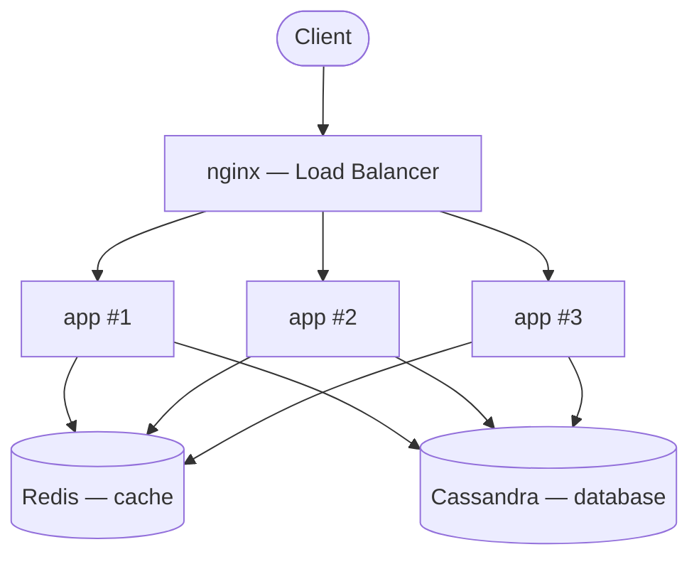
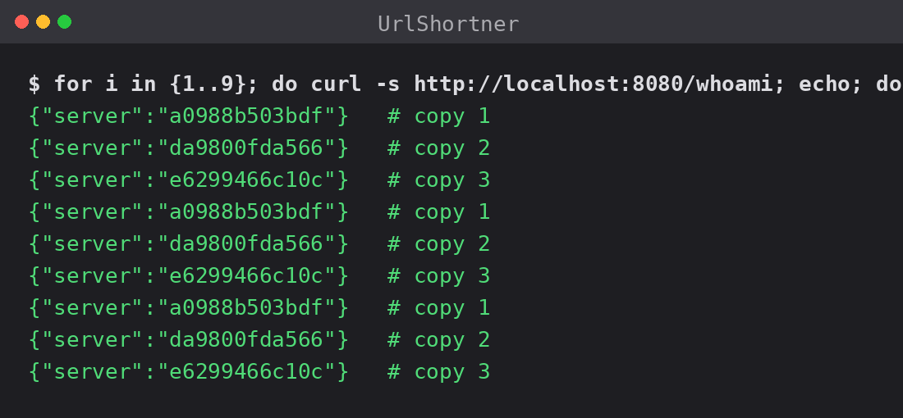
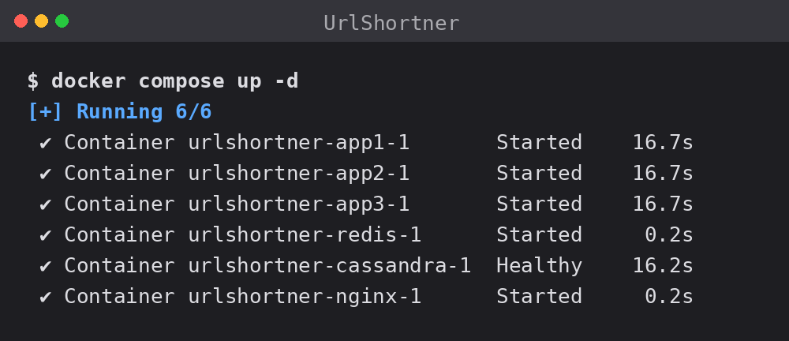
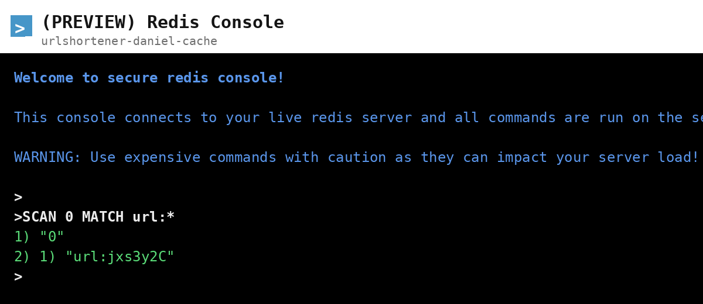

# URL Shortener — a System Design Study in .NET

A URL shortener (think TinyURL / Bitly) built from scratch in **.NET 9**, with a **Cassandra** database, a **Redis** cache, an **nginx** load balancer, and a piece deployed to **Azure**.

> **Why I built this:** I watched a [system design video about architecting a URL shortener](https://www.youtube.com/watch?v=m_anIoKW7Jg) and, instead of just watching, I decided to actually build it — to really understand how the load balancer, the database, and the cache fit together, and why each choice is made. This README follows the same order I learned things.

---

## What it does

- **Shorten:** send a long URL, get back a short code (e.g. `jxs3y2C`).
- **Redirect:** open the short link, get sent to the original URL.

That's it on the surface. The interesting part is everything behind it that makes it fast and able to handle lots of traffic.

---

## The big picture



Three identical copies of the app run at the same time. A **load balancer** sits in front and splits the traffic between them. All three share the same **database** (Cassandra) and **cache** (Redis).

The trick that makes this work: the app doesn't keep anything in its own memory — everything is stored in the database and cache. So it doesn't matter which copy answers a request; they all see the same data. That's what lets you just add more copies when traffic grows.

---

## Tech stack

| Piece | Technology | What it's for |
|---|---|---|
| API | .NET 9 (Minimal API) | The two endpoints: shorten and redirect |
| Short code | Base62 | Turns a number into a short, URL-friendly code |
| Database | Cassandra | Stores every `code → long URL`, built to scale |
| Cache | Redis | Keeps popular links in memory for instant answers |
| Load balancer | nginx | Splits traffic across the app copies |
| Docs | Swagger | Click-to-test the API in the browser |
| Packaging | Docker | Wraps the app so it runs the same anywhere |
| Orchestration | Docker Compose | Starts everything together with one command |
| Cloud | Azure Cache for Redis | Managed cache running in Azure |

---

## How a request travels

**Creating a short link (`POST /shorten`)**
1. Check the URL is valid.
2. Make a short code (and try again if it happens to collide).
3. Save it in the database and drop a copy in the cache.
4. Return the short link.

**Using a short link (`GET /{code}`)**
1. The request hits **nginx**, which hands it to one of the three app copies.
2. That copy looks in **Redis** first:
   - **Found in cache** → answer right away.
   - **Not in cache** → read from **Cassandra**, save it in Redis for next time, then answer.
3. The app redirects the user to the original URL.

---

## The journey (why each choice)

**1. Short codes with Base62.** The code needs to be short and unique. Base62 uses digits + lowercase + uppercase letters — all the characters that are safe in a URL. Just 7 of them cover about **3.5 trillion** links.

**2. Cassandra as the database.** A shortener only ever looks things up one way: "give me the URL for this code." Cassandra is built exactly for that kind of lookup and can spread the data across many machines as it grows.

**3. Redis as a cache.** Every redirect would otherwise hit the database — even though a popular link gives the *same answer* every time. Redis keeps hot links in memory, so repeated clicks are answered instantly and the database is left alone. It works well here because reads dominate, the data never changes, and a few links get most of the traffic.

- The cache was added **without touching the rest of the code**, by wrapping the database layer in a caching layer that looks identical from the outside. Swapping between "database only" and "database + cache" is a one-line change.

**4. Redirect type: 301 vs 302.** A `301` is remembered by the browser (super fast, but you can't count clicks). A `302` always comes back through the server (a bit slower, but you *can* track clicks and change the destination later). **I went with 302** to keep analytics possible.

**5. Config instead of hardcoding.** Database and cache addresses aren't baked into the code — they're read from settings, with sensible defaults. So the same app runs on my laptop, in Docker, or in the cloud without any code change. Passwords live in a local secret store, never in the repo.

**6. The app sets up its own database.** On startup it creates the keyspace and table if they don't exist yet — so a fresh database just works, no manual setup.

**7. Docker.** The app is packaged into an image so it runs identically anywhere. The build is done in two stages: a heavy stage compiles it, and a light stage keeps only the finished app — so the final image stays small.

**8. Load balancing with nginx + 3 copies.** One command (`docker compose up`) starts nginx, three app copies, Cassandra, and Redis, all wired together. nginx spreads requests across the copies in a simple rotation. A tiny `/whoami` endpoint proves it:

```
$ for i in {1..9}; do curl -s http://localhost:8080/whoami; echo; done
{"server":"a0988b503bdf"}   # copy 1
{"server":"da9800fda566"}   # copy 2
{"server":"e6299466c10c"}   # copy 3
{"server":"a0988b503bdf"}   # copy 1 again...
```



All six containers running together with one command:



**9. Moving the cache to Azure.** The Redis cache was migrated to **Azure Cache for Redis**, a managed service — Azure handles the upkeep, in exchange for cost and a bit less control. It connects securely over TLS, and the password stays in the local secret store.

---

## Trade-offs

| Decision | I chose | Why | The catch |
|---|---|---|---|
| Database | Cassandra | Scales sideways, perfect for simple lookups | Overkill for a small app — a single SQL database would be simpler |
| Redirect | 302 | Lets me track clicks | A little slower than 301 |
| Cache | Wrap the database in a caching layer | Keeps the code clean and easy to swap | One extra layer to maintain |
| Managed vs self-hosted cache | Azure (managed) | No maintenance work | Costs money, less control |
| Cache tier | Basic (cheapest) | Fine for a study project | No uptime guarantee; single node |
| Load balancer | Local Docker + nginx | Fully offline, and you can see exactly how it works | It's not "the cloud" yet — that's the next step |

---

## Running it locally

You just need Docker Desktop.

```bash
# from the folder with compose.yaml
docker build -t urlshortner -f UrlShortner/Dockerfile .
docker compose up -d
```

Then:

- The app (behind the load balancer): `http://localhost:8080`
- See the rotation: `for i in {1..9}; do curl -s http://localhost:8080/whoami; echo; done`
- Shorten a link:
  ```bash
  curl -X POST http://localhost:8080/shorten \
    -H "Content-Type: application/json" \
    -d '{"url":"https://example.com/some/long/path"}'
  ```

For day-to-day development with the Swagger UI, run a single copy:

```bash
cd UrlShortner
dotnet run
# Swagger at http://localhost:<port>/swagger
```

---

## The Azure part

> _Screenshots coming — see "What's next"._

The cache runs on **Azure Cache for Redis**:

- Secure (TLS-only) connection.
- The password is kept in a local secret store, never in the repo.
- Public access has to be turned on deliberately — it starts off, which is actually a good security default.

Drop your Azure screenshots into `docs/` and reference them here, e.g.:

```markdown


```

<!-- Suggested shots:
  - Redis Console running `SCAN 0 MATCH url:*` (proves the app cached in the cloud)
  - Overview / Metrics (the managed cache live and handling load)
  - Access keys screen — blur the key!
-->

---

## What I learned

- How short codes are made (Base62) and how many links they cover
- How Cassandra stores data so lookups stay fast at scale
- Why (and how) to put a cache in front of a database
- Why keeping the app "memory-free" is what makes load balancing possible
- How a load balancer spreads traffic across copies
- How Docker packages an app, and how Compose runs many pieces together
- How to keep passwords out of the code
- The difference between running things yourself and using a managed cloud service

---

## What's next

- **Add the Azure screenshots** to the section above.
- **Move the database to the cloud** (Azure Cosmos DB, which speaks Cassandra) — same code, just a different address.
- **Host the app in the cloud** (Azure Container Apps) with automatic scaling and load balancing.
- **Cold storage (S3 / Azure Blob):** in the video, **S3** is used to park old, rarely-used links in cheap storage — moved there during quiet hours so the main database stays lean and cheap. Hot links stay in Cassandra + Redis; only "cold" ones age out. Not built here yet — it's the natural next scaling step.
```
