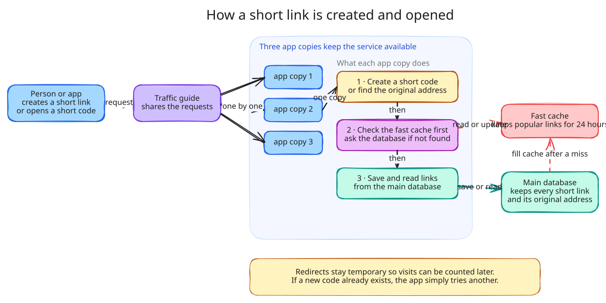
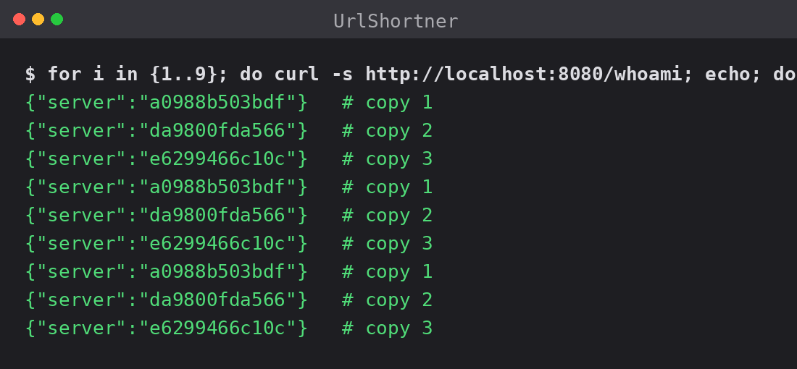
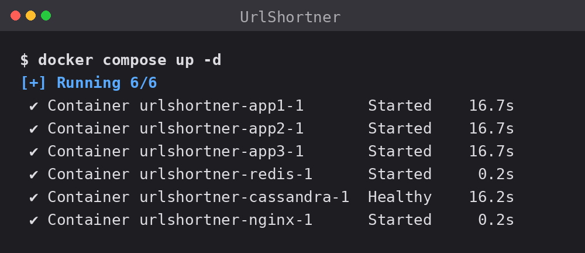
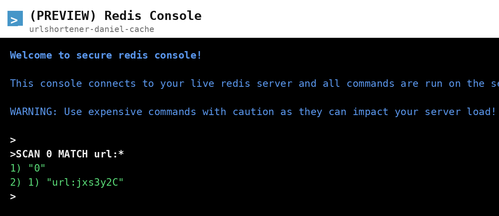

# URL Shortener — a System Design Study in .NET

This software makes short links. You give it a long web address. It gives you back a short link, for example `http://localhost:8080/jxs3y2C`. When somebody opens the short link, the software sends the browser to the long address.

I built it as a study project in **.NET 9**. It uses a **Cassandra** database, a **Redis** cache, and an **nginx** load balancer. One part of it ran on **Azure**.

> **Why I built this:** I watched a [system design video about a URL shortener](https://www.youtube.com/watch?v=m_anIoKW7Jg). I did not want to only watch. I built the system to understand how the load balancer, the database, and the cache work together.

---

## What it does

- **Shorten:** send `POST /shorten` with a long URL. The answer is `201 Created` with a short code (for example `jxs3y2C`), the full short link, and a `Location` header.
- **Redirect:** open `GET /{code}`. The answer is a `302` redirect to the original URL.
- **Identify:** open `GET /whoami`. The answer names the app copy that replied.

Three facts to know:

- The software does not remember URLs it saw before. If you send the same URL two times, you get two different codes.
- A short link never expires. Cassandra keeps every link with no time limit.
- The software does not count clicks. The `302` redirect keeps that possible, but no counting is built.

---

## The big picture



*Editable source: [`docs/architecture.excalidraw`](docs/architecture.excalidraw) — open it on [excalidraw.com](https://excalidraw.com) and export the SVG again after changes.*

Three identical copies of the app run at the same time. **nginx** sits in front and gives each request to one of the copies, in rotation. All three copies share one **Cassandra** database and one **Redis** cache.

The app keeps no data in its own memory. All data lives in the database and the cache. So every copy sees the same data, and any copy can answer any request. That is what lets you add more copies when traffic grows.

nginx also passes the caller's `Host` header to the app. The app builds the short link from that header. So the link you get back (`http://localhost:8080/{code}`) works from outside. Without this nginx setting, the link would carry an internal host name and would not work.

---

## How a short link is created

Step by step:

1. The app checks the URL. The URL must be absolute, and its scheme must be `http` or `https`. The app rejects `ftp://`, relative paths, and empty strings with `400`.
2. The app draws a code: 7 random characters from the base62 alphabet (`0-9`, `a-z`, `A-Z`). It does not encode a number and it keeps no counter. Seven characters give 62⁷ codes — about **3.5 trillion**.
3. The app claims the code in Cassandra with `INSERT ... IF NOT EXISTS`. Only one request can win a code. A code is never overwritten in silence.
4. If the code is already taken, the app draws a new code. After **5** failed draws the app stops and answers `503` with the error contract. Five collisions in a row against 3.5 trillion codes means something is broken, so retrying forever would not help.
5. The app writes a copy of the winning link to Redis. The copy expires after 24 hours. Only a winning insert is cached, so the cache can never serve another request's destination.
6. The app answers `201 Created` with the code and the short link.

Why the conditional write matters: a plain Cassandra `INSERT` is an *upsert*. If two requests draw the same code, both writes "succeed" and the second replaces the first in silence. A "does this code exist?" check before the write does not help, because both requests can read "no" before either writes. `IF NOT EXISTS` makes Cassandra pick exactly one winner. The loser just draws again.

---

## How a short link is opened

1. The request hits **nginx**. nginx hands it to one of the three app copies.
2. The route only matches paths of exactly **7 characters**. A path with another length (for example `/favicon.ico`) gets a plain `404` with an empty body. It never reaches the lookup code.
3. The app looks in **Redis** first:
   - **Found in cache** → answer at once.
   - **Not in cache** → read from **Cassandra**, save a copy in Redis for 24 hours, then answer.
4. The app answers `302 Found` and the browser goes to the original URL.
5. A 7-character code that is not in the database gets `404` with the error contract.

The redirect is a `302`, not a `301`. A `301` is remembered by the browser, so later clicks never reach the server. A `302` always comes back through the server. That keeps click counting possible in the future. No counting exists today.

---

## Error responses

Almost every error uses one JSON shape, `ErrorResponse`:

```json
{ "errors": ["The url must be an absolute http or https address."], "correlationId": null }
```

| What happened | Status | Body |
|---|---|---|
| URL is not an absolute `http`/`https` address | `400` | `ErrorResponse` |
| Body cannot be read (empty, `null`, `{"url":null}`, `{"url":123}`, cut-off JSON) | `400` | `ErrorResponse` |
| Code has 7 characters but is unknown | `404` | `ErrorResponse` |
| Path length is not 7 characters | `404` | empty body (no route matched) |
| 5 draws in a row hit taken codes | `503` | `ErrorResponse` |
| Unexpected failure | `500` | `ErrorResponse` with a `correlationId` that also appears in the server log |
| `Content-Type` is not JSON | `415` | framework `ProblemDetails`, **not** `ErrorResponse` |

The `415` case is the one known answer outside the contract.

---

## What the software needs

- **At startup** the app connects to Cassandra and to Redis immediately. If either one is not reachable, the process stops. Docker Compose waits for the Cassandra health check before it starts the app copies. For Redis it only waits for the container to start. There is no restart policy.
- **At startup** the app also creates its own keyspace and table in Cassandra if they do not exist. A fresh database works without manual setup. A production service would do this in a deployment step instead.
- **At runtime** Redis stays required. Every read and write goes through the cache layer first. If Redis goes down while the app runs, both endpoints answer `500`. The app does not fall back to Cassandra when the cache fails. This fail-fast design is a deliberate choice for a study project.

---

## Tech stack

| Piece | Technology | What it does here |
|---|---|---|
| API | .NET 9 (MVC controllers) | The endpoints: shorten, redirect, whoami |
| Short code | Random base62 draw | 7 random characters from `0-9`, `a-z`, `A-Z` |
| Database | Cassandra | Keeps every `code → long URL` row, with no expiry |
| Cache | Redis | Keeps recent links in memory for 24 hours |
| Load balancer | nginx | Splits traffic across the app copies and forwards the caller's `Host` |
| Docs | Swagger | Click-to-test UI — **Development only** (`dotnet run`); the Compose stack runs in Production and has no Swagger |
| Packaging | Docker | Two-stage build; the final image holds only the compiled app |
| Orchestration | Docker Compose | Starts nginx, 3 app copies, Cassandra, and Redis with one command |
| Cloud | Azure Cache for Redis | Managed cache used in one setup, over TLS |

---

## Design choices

**1. Cassandra as the database.** A shortener asks the data one question: "which URL belongs to this code?" Cassandra answers that kind of lookup fast, and it can spread data across many machines.

**2. The cache is a wrapper.** The Redis layer wraps the database layer and shows the same interface. The rest of the code does not know the cache exists. Swapping between "database only" and "database + cache" is a one-line change in the service registration.

**3. Configuration, not hardcoding.** The Cassandra host and the Redis address come from settings, with local defaults. The same app runs on a laptop, in Docker, or in the cloud without a code change. Passwords live in a local secret store, never in the repository.

**4. Load balancing you can see.** `GET /whoami` names the copy that answered:

```
$ for i in {1..9}; do curl -s http://localhost:8080/whoami; echo; done
{"server":"a0988b503bdf"}   # copy 1
{"server":"da9800fda566"}   # copy 2
{"server":"e6299466c10c"}   # copy 3
{"server":"a0988b503bdf"}   # copy 1 again...
```



All six containers start with one command:



---

## Trade-offs

| Decision | I chose | Why | The catch |
|---|---|---|---|
| Database | Cassandra | Scales sideways; perfect for one-key lookups | Too big for a small app — one SQL database would be simpler |
| Redirect | 302 | Keeps click counting possible later | A little slower than 301; no counting is built yet |
| Cache | Wrap the database in a cache layer | Keeps the code clean and easy to swap | One more layer; Redis becomes required at runtime |
| Cache failure | Fail fast (no fallback) | Simple and honest for a study project | Redis down means the API answers 500 |
| Managed vs self-hosted cache | Azure (managed) | No maintenance work | Costs money; less control |
| Cache tier | Basic (cheapest) | Fine for a study project | No uptime guarantee; single node |
| Load balancer | Local Docker + nginx | Fully offline; easy to inspect | Not "the cloud" yet — that is the next step |

---

## Running it locally

You need Docker Desktop.

```bash
# from the folder with compose.yaml
docker build -t urlshortner -f UrlShortner/Dockerfile .
docker compose up -d
```

Then:

- The app, behind the load balancer: `http://localhost:8080`
- See the rotation: `for i in {1..9}; do curl -s http://localhost:8080/whoami; echo; done`
- Shorten a link:
  ```bash
  curl -X POST http://localhost:8080/shorten \
    -H "Content-Type: application/json" \
    -d '{"url":"https://example.com/some/long/path"}'
  ```

For day-to-day development with the Swagger UI, run a single copy:

```bash
cd UrlShortner
dotnet run
# Swagger at http://localhost:<port>/swagger
```

Swagger only exists in this Development mode. In Development, the Swagger middleware runs before the routes, so the 7-character path `/swagger` is served as the UI and is never treated as a short code.

---

## The Azure part

One setup ran the cache on **Azure Cache for Redis**:

- The connection uses TLS only.
- The password stays in a local secret store, never in the repository.
- Public access starts off and must be turned on with intent — a good security default.

Proof that the app wrote to the managed cache — `SCAN 0 MATCH url:*` returns the key the app wrote:



---

## What I learned

- How random base62 codes work and how many links 7 characters can cover
- Why a conditional write (`IF NOT EXISTS`) is the only safe way to claim a code
- Why and how to put a cache in front of a database
- Why a "memory-free" app is what makes load balancing possible
- How a load balancer spreads traffic, and why it must forward the `Host` header
- How Docker packages an app, and how Compose runs many pieces together
- How to keep passwords out of the code
- The difference between self-hosted services and a managed cloud service

---

## What's next

- **Move the database to the cloud** (Azure Cosmos DB, which speaks Cassandra) — same code, different address.
- **Host the app in the cloud** (Azure Container Apps) with automatic scaling and load balancing.
- **Cold storage (S3 / Azure Blob):** the system-design walkthrough parks old, rarely-used links in cold storage during quiet hours. Hot links stay in Cassandra + Redis. Not built here yet.
